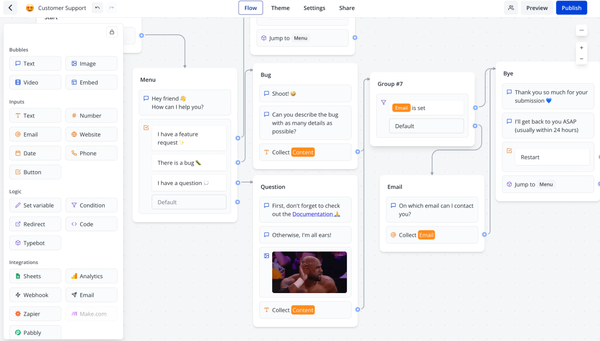

# Typebot CI/CD pipeline

Deploy Typebot server with CI/CD on Elestio

 
 

# Once deployed ...

You can open Typebot Builder UI here:

    URL: https://[CI_CD_DOMAIN]:8443
    Login: [ADMIN_EMAIL]
